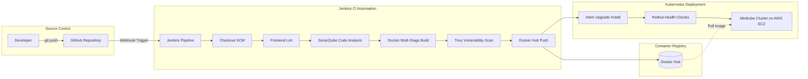
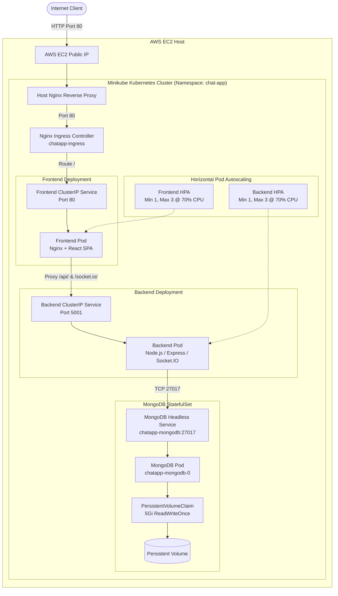
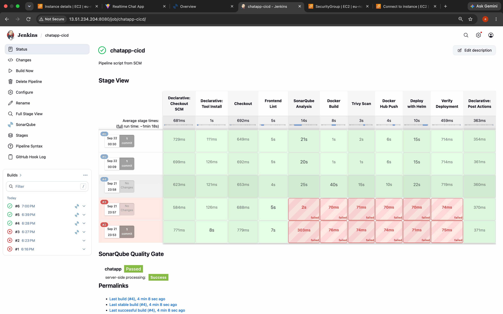
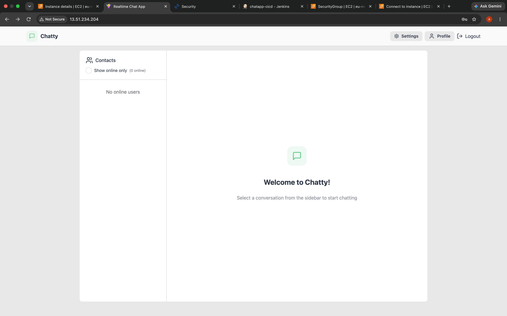
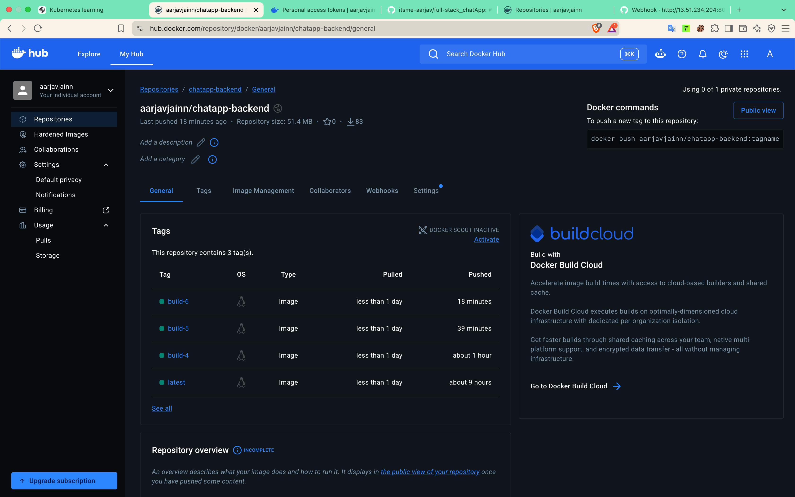
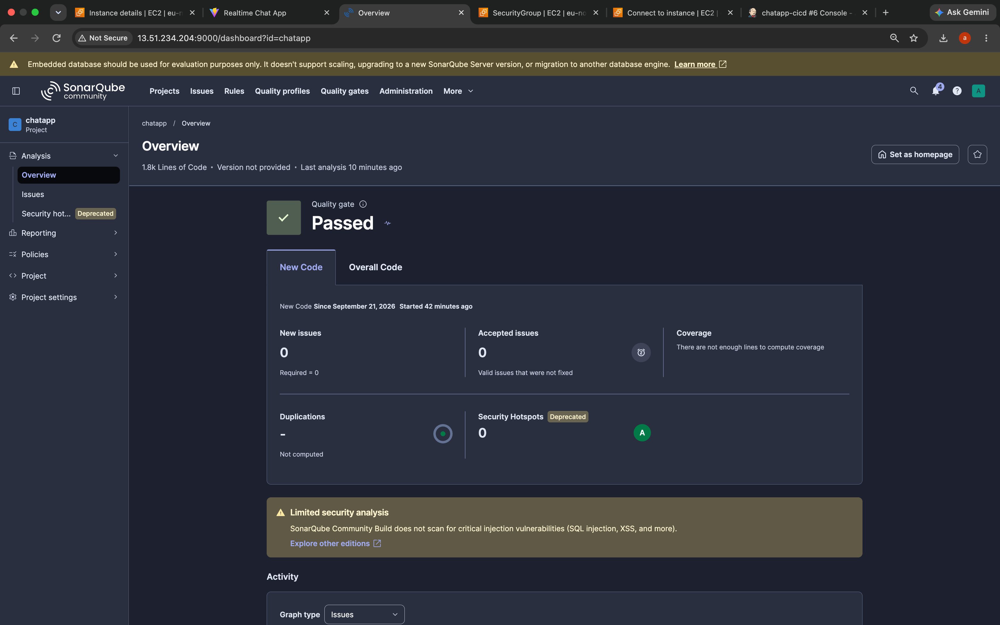
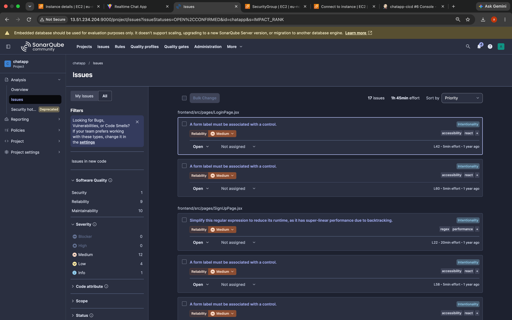
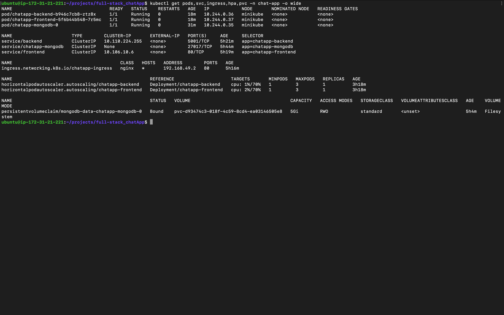

# Full-Stack Real-Time Chat Application: DevOps and Kubernetes Infrastructure

[](./Jenkinsfile)
[](./helm/chatapp)
[](https://www.sonarqube.org/)
[](https://github.com/aquasecurity/trivy)
[](https://hub.docker.com/u/aarjavjainn)

This repository contains the DevOps setup and deployment pipeline for a full-stack real-time chat application named Chatty. The application uses a React frontend, a Node.js Express backend with Socket.IO, and a MongoDB database. The core focus of this project is automating the build, test, security scanning, container packaging, and Kubernetes deployment workflows.

---

## Table of Contents

1. [Project Overview](#project-overview)
2. [System Architecture](#system-architecture)
3. [End-to-End CI/CD Pipeline](#end-to-end-cicd-pipeline)
4. [Live Deployment and Traffic Routing](#live-deployment-and-traffic-routing)
5. [Docker Containerization](#docker-containerization)
6. [Code Quality Analysis (SonarQube)](#code-quality-analysis-sonarqube)
7. [Security and Secrets Management](#security-and-secrets-management)
8. [Kubernetes Workloads and Orchestration](#kubernetes-workloads-and-orchestration)
9. [Horizontal Pod Autoscaling (HPA)](#horizontal-pod-autoscaling-hpa)
10. [Helm Packaging and Releases](#helm-packaging-and-releases)
11. [Failure Recovery and Rollback Testing](#failure-recovery-and-rollback-testing)
12. [Database Persistence](#database-persistence)
13. [Repository Structure](#repository-structure)
14. [DevOps Competency Matrix](#devops-competency-matrix)
15. [Key Engineering Takeaways](#key-engineering-takeaways)

---

## Project Overview

While the application code provides real-time messaging capabilities, this repository demonstrates how to manage the end-to-end infrastructure and delivery pipeline for a containerized microservice stack.

### Key Infrastructure Highlights

| Domain | Implementation Summary |
|---|---|
| CI/CD Automation | Automated 8-stage Jenkins declarative pipeline triggered via GitHub Webhook |
| Static Code Analysis | Automated SonarQube code inspection integrated into build pipeline |
| Container Security | Vulnerability scanning using Trivy before pushing images to Docker Hub |
| Container Strategy | Multi-stage Docker builds producing lightweight Alpine images running as non-root users |
| Cluster Orchestration | Declarative deployments on a Kubernetes cluster hosted on AWS EC2 using Helm |
| Ingress Routing | Nginx reverse proxy routing HTTP traffic and proxying WebSocket connections |
| Elastic Autoscaling | Horizontal Pod Autoscaling (HPA) scaling pods dynamically based on CPU utilization |
| Stateful Storage | MongoDB running as a StatefulSet with PersistentVolumeClaims for durable storage |
| Release Management | Ephemeral secret injection during deployment and verified Helm rollback procedures |

---

## System Architecture

### 1. CI/CD Pipeline Workflow



---

### 2. Runtime Ingress and Traffic Flow



---

## End-to-End CI/CD Pipeline

The Continuous Integration and Continuous Deployment pipeline runs automatically via a declarative [Jenkinsfile](./Jenkinsfile) hosted on an AWS EC2 instance.

### Pipeline Stages

| Stage Number | Stage Name | Actions and Commands |
|---|---|---|
| 1 | Checkout | Clones the repository revision triggered by the GitHub Webhook |
| 2 | Frontend Lint | Runs `npm ci` and `npm run lint` inside the frontend directory |
| 3 | SonarQube Analysis | Runs `sonar-scanner` across backend and frontend code to evaluate quality |
| 4 | Docker Build | Compiles Docker images tagged as `aarjavjainn/chatapp-backend:build-${BUILD_NUMBER}` and `aarjavjainn/chatapp-frontend:build-${BUILD_NUMBER}` |
| 5 | Trivy Scan | Scans container images for HIGH and CRITICAL vulnerabilities using `--ignore-unfixed` |
| 6 | Docker Hub Push | Logs into Docker Hub using stored Jenkins credentials and pushes versioned images |
| 7 | Deploy with Helm | Writes a temporary `values-secret.yaml` file (permissions `077`), applies `helm upgrade --install --wait`, and removes the secrets file |
| 8 | Verify Deployment | Checks workload rollout status with `kubectl rollout status` and prints pod and HPA health |


*Figure 1: Jenkins Declarative Pipeline execution showing successful builds and SonarQube stage integration.*

---

## Live Deployment and Traffic Routing

The application is hosted on a Kubernetes cluster running on an AWS EC2 instance accessible over standard HTTP port 80.

### Request Routing Path

1. Client sends request to AWS EC2 Public IP (`13.51.234.204:80`).
2. The host Nginx reverse proxy forwards traffic to the Minikube Ingress Controller (`192.168.49.2:80`).
3. Kubernetes Ingress (`chatapp-ingress`) routes incoming requests to the frontend service.
4. The frontend container Nginx server delivers React static files and proxies `/api/` and `/socket.io/` requests internally to `http://backend:5001`.


*Figure 2: Running instance of the Chatty application accessed through the AWS EC2 public endpoint.*

---

## Docker Containerization

Both services use multi-stage Docker builds to keep image sizes small and remove unnecessary build tools from the final runtime containers.

### Backend Container (`backend/Dockerfile`)

1. Stage 1 (Builder): Uses `node:18-alpine` to run `npm ci --only=production`.
2. Stage 2 (Runtime): Starts from minimal `node:18-alpine` and copies production dependencies.
3. Security Hardening: Creates and switches to a non-root system user (`appuser:appgroup`), preventing root privilege escalation.
4. Exposed Port: `5001`.

### Frontend Container (`frontend/Dockerfile` & `frontend/nginx.conf`)

1. Stage 1 (Builder): Installs packages and builds production bundles using Vite (`npm run build`).
2. Stage 2 (Runtime): Copies compiled HTML, JS, and CSS files into `nginx:stable-alpine`.
3. Integrated Proxy: Nginx handles SPA client-side routing (`try_files $uri $uri/ /index.html;`) and reverse-proxies `/api/` and `/socket.io/` WebSocket connections to the backend service.
4. Compression and Headers: Gzip compression is enabled, along with standard security headers (`X-Frame-Options`, `X-Content-Type-Options`, `X-XSS-Protection`, and `Content-Security-Policy`).

### Image Versioning on Docker Hub

All images are pushed to Docker Hub with immutable build tags alongside the `latest` tag:

| Service | Repository Name | Published Tags |
|---|---|---|
| Backend | `aarjavjainn/chatapp-backend` | `build-4`, `build-5`, `build-6`, `latest` |
| Frontend | `aarjavjainn/chatapp-frontend` | `build-4`, `build-5`, `build-6`, `latest` |

<p align="center">
  
  
</p>

*Figure 3: Docker Hub repositories displaying versioned build tags for backend and frontend images.*

---

## Code Quality Analysis (SonarQube)

Code quality scanning runs automatically in the CI pipeline using SonarQube Community Edition and `sonar-scanner`.

### Scan Parameters

| Parameter | Value |
|---|---|
| Project Key | `chatapp` |
| Source Directories | `backend`, `frontend` |
| Excluded Paths | `**/node_modules/**`, `**/dist/**`, `**/public/**` |

### Analysis Output

| Metric | Result |
|---|---|
| Quality Gate Status | Passed |
| New Issues | 0 |
| Security Hotspots | 0 (Grade A) |

<p align="center">
  
  
</p>

*Figure 4: SonarQube project dashboard confirming Quality Gate pass status.*

---

## Security and Secrets Management

Security practices applied across the development and deployment lifecycle:

### 1. Container Vulnerability Scanning with Trivy

Before pushing images to Docker Hub, Trivy checks for known CVEs:

```bash
trivy image --severity HIGH,CRITICAL --ignore-unfixed "$DOCKERHUB_REPO_BACKEND:$IMAGE_TAG"
trivy image --severity HIGH,CRITICAL --ignore-unfixed "$DOCKERHUB_REPO_FRONTEND:$IMAGE_TAG"
```

### 2. Runtime Container Hardening

The backend deployment enforces restricted container execution privileges:

```yaml
securityContext:
  runAsNonRoot: true
  runAsUser: 100
  allowPrivilegeEscalation: false
  capabilities:
    drop:
      - ALL
  seccompProfile:
    type: RuntimeDefault
```

### 3. Secrets Lifecycle

1. No plain-text secrets or credentials are committed to Git.
2. Credentials (`JWT_SECRET`, MongoDB username, MongoDB password) are stored in Jenkins Credential Store.
3. During deployment, Jenkins creates an ephemeral `values-secret.yaml` file with restricted file permissions (`077`), passes it to Helm, and automatically deletes it in the `post { always }` block.
4. Local secret files are excluded via `.gitignore`, while a sanitized [.env.example](./.env.example) is provided for local reference.

---

## Kubernetes Workloads and Orchestration

All application components are deployed in the isolated `chat-app` namespace using Helm templates.


*Figure 5: Active workloads, services, ingress, autoscalers, and persistent storage in the chat-app namespace.*

### Workload Summary

| Workload Name | Kind | Replicas | Port | Probes |
|---|---|---|---|---|
| `chatapp-backend` | Deployment | 1 (Autoscales to 3) | 5001 (ClusterIP) | Readiness & Liveness: TCP Socket on port 5001 |
| `chatapp-frontend` | Deployment | 1 (Autoscales to 3) | 80 (ClusterIP) | Readiness & Liveness: HTTP GET on port 80 |
| `chatapp-mongodb` | StatefulSet | 1 | 27017 (Headless) | Readiness & Liveness: TCP Socket on port 27017 |

### Health Probes and Checks

Readiness probes ensure traffic is only routed to containers once they are fully initialized and ready to handle requests. Liveness probes periodically verify container responsiveness and trigger automatic restarts if a service hangs.

### Resource Requests and Limits

Explicit CPU and memory boundaries prevent pods from consuming excessive cluster resources:

```yaml
# Backend Resource Settings
resources:
  requests:
    cpu: 100m
    memory: 128Mi
  limits:
    cpu: 500m
    memory: 512Mi

# Frontend Resource Settings
resources:
  requests:
    cpu: 50m
    memory: 64Mi
  limits:
    cpu: 200m
    memory: 256Mi

# MongoDB Resource Settings
resources:
  requests:
    cpu: 100m
    memory: 256Mi
  limits:
    cpu: 500m
    memory: 512Mi
```

---

## Horizontal Pod Autoscaling (HPA)

HorizontalPodAutoscaler (HPA v2) rules are configured for the frontend and backend deployments, pulling live utilization metrics from Kubernetes Metrics Server.

### Autoscaling Rules

| Workload | Min Replicas | Max Replicas | CPU Target |
|---|---|---|---|
| `chatapp-backend` | 1 | 3 | 70% average utilization |
| `chatapp-frontend` | 1 | 3 | 70% average utilization |

```yaml
spec:
  scaleTargetRef:
    apiVersion: apps/v1
    kind: Deployment
    name: chatapp-backend
  minReplicas: 1
  maxReplicas: 3
  metrics:
    - type: Resource
      resource:
        name: cpu
        target:
          type: Utilization
          averageUtilization: 70
```

---

## Helm Packaging and Releases

All Kubernetes manifests are grouped into a modular Helm chart located in [helm/chatapp/](./helm/chatapp/).

### Chart Directory Layout

```
helm/chatapp/
├── Chart.yaml                  Chart metadata
├── values.yaml                 Default configuration values
├── .helmignore
└── templates/
    ├── _helpers.tpl            Template helper functions
    ├── backend-deployment.yaml Backend Deployment manifest
    ├── backend-service.yaml    Backend ClusterIP Service
    ├── frontend-deployment.yaml Frontend Deployment manifest
    ├── frontend-service.yaml   Frontend ClusterIP Service
    ├── mongodb-statefulset.yaml MongoDB StatefulSet definition
    ├── mongodb-service.yaml    MongoDB Headless Service
    ├── ingress.yaml            Ingress routing rules
    ├── hpa.yaml                HorizontalPodAutoscaler rules
    ├── configmap.yaml          Application environment variables
    └── secret.yaml             Dynamically populated secrets
```

### Helm Deployment Command

The CI/CD pipeline deploys the chart atomically using:

```bash
helm upgrade chatapp ./helm/chatapp \
  --namespace chat-app \
  --create-namespace \
  --install \
  --wait \
  --timeout 5m \
  -f helm/chatapp/values-secret.yaml \
  --set backend.image.repository="$DOCKERHUB_REPO_BACKEND" \
  --set backend.image.tag="$IMAGE_TAG" \
  --set frontend.image.repository="$DOCKERHUB_REPO_FRONTEND" \
  --set frontend.image.tag="$IMAGE_TAG"
```

---

## Failure Recovery and Rollback Testing

To confirm cluster resilience and disaster recovery workflows, deployment failure and recovery scenarios were tested directly:

### 1. Simulated Bad Deployment

An invalid image tag was provided to a Helm deployment command. Kubernetes attempted a rolling update, but newly scheduled pods entered an `ImagePullBackOff` state. Because Kubernetes rolling updates maintain existing healthy pods until new ones pass readiness checks, the running application remained uninterrupted.

### 2. Helm History Audit

Running `helm history chatapp -n chat-app` tracked the deployment states:

1. Revision 22: Marked as `failed` due to deployment timeout on bad image configuration.
2. Revision 23: Rollback command issued via `helm rollback chatapp 21 -n chat-app`.
3. Revision 24: Restored to healthy `deployed` state.

### 3. Recovery Verification

Running `kubectl rollout status` confirmed immediate restoration to the last working release without downtime.

---

## Database Persistence

MongoDB requires persistent data storage that survives pod restarts and redeployments.

### Storage Configuration

1. Workload Type: Deployed as a `StatefulSet` (`chatapp-mongodb`) to guarantee stable network identity (`chatapp-mongodb-0`) and dedicated volume bindings.
2. Volume Claim Template: Requests a `5Gi` volume with `ReadWriteOnce` access mode bound to the default storage class.
3. Persistent Volume Claim: `mongodb-data-chatapp-mongodb-0` is bound to volume `pvc-d93474c3-018f-4c59-8cd4-ea03146505e8`.

### Persistence Validation Test

1. The running MongoDB pod was manually deleted (`kubectl delete pod chatapp-mongodb-0 -n chat-app`).
2. The StatefulSet controller automatically recreated the pod.
3. The newly started pod attached to the existing Persistent Volume Claim.
4. Stored user accounts, messages, and chat history remained intact.

---

## Repository Structure

```
full-stack_chatApp/
├── Jenkinsfile                 Jenkins declarative CI/CD pipeline
├── docker-compose.yml          Local development container setup
├── .env.example                Sanitized environment template
├── .gitignore                  Git exclusions
├── README.md                   Project documentation and architecture guide
│
├── backend/                    Backend service
│   ├── Dockerfile              Multi-stage non-root backend image build
│   ├── package.json            Dependencies and scripts
│   └── src/                    Backend application code
│
├── frontend/                   Frontend service
│   ├── Dockerfile              Multi-stage frontend build with Nginx runtime
│   ├── nginx.conf              SPA routing, security headers, reverse proxy
│   ├── package.json            Dependencies and scripts
│   └── src/                    Frontend application code
│
├── helm/                       Kubernetes Helm charts
│   └── chatapp/                Chart templates and default values
│       ├── Chart.yaml
│       ├── values.yaml
│       └── templates/
│
└── docs/                       Documentation assets
    └── screenshots/            Verified pipeline and cluster screenshots
```

---

## DevOps Competency Matrix

| Technology | Role in Project | Implementation Details |
|---|---|---|
| Git and GitHub | Source Control | Feature branching, commit history, automated Webhook triggers |
| Jenkins | Continuous Integration | Declarative multi-stage pipeline, automated linting, SonarQube scan, Docker builds |
| SonarQube | Code Quality | Static code inspection, vulnerability analysis, quality gate verification |
| Trivy | Container Security | Automated CVE scanning for HIGH and CRITICAL image vulnerabilities |
| Docker | Containerization | Multi-stage Dockerfiles, minimal Alpine runtimes, non-root execution |
| Docker Hub | Artifact Registry | Versioned immutable image tags (`build-${BUILD_NUMBER}`) |
| Kubernetes | Cluster Orchestration | Isolated namespace, Deployments, StatefulSets, Services, ConfigMaps, Secrets |
| Helm | Configuration Management | Templated releases, atomic `--wait` updates, rollback support |
| Nginx | Ingress and Reverse Proxy | Host reverse proxying, Kubernetes Ingress routing, WebSocket forwarding |
| Kubernetes Probes | Service Reliability | TCP and HTTP readiness and liveness checks for automatic self-healing |
| HPA | Elastic Scaling | CPU-based pod scaling from 1 to 3 replicas at 70% utilization |
| StatefulSet & PVC | Database Durability | StatefulSet deployment with 5Gi persistent volume claim |
| Helm Rollbacks | Disaster Recovery | Recovery from simulated deployment failures back to stable revisions |

---

## Key Engineering Takeaways

1. Early Vulnerability Scanning: Integrating Trivy into the CI pipeline prevents insecure container layers from being pushed to container registries or deployed to clusters.
2. Atomic Helm Deployments: Using `--wait` and `--timeout` ensures that pipelines only pass when all pods have successfully started and passed readiness probes.
3. Multi-Stage Build Optimization: Keeping build-time tools separate from runtime containers significantly reduces image sizes and minimizes potential attack surfaces.
4. Workload Separation: Stateless services scale efficiently with Deployments and HPA, while stateful databases require StatefulSets and PersistentVolumeClaims for data persistence.
5. Non-Root Security Practices: Running container processes with non-root user permissions (`runAsNonRoot: true`) limits container escape risks.